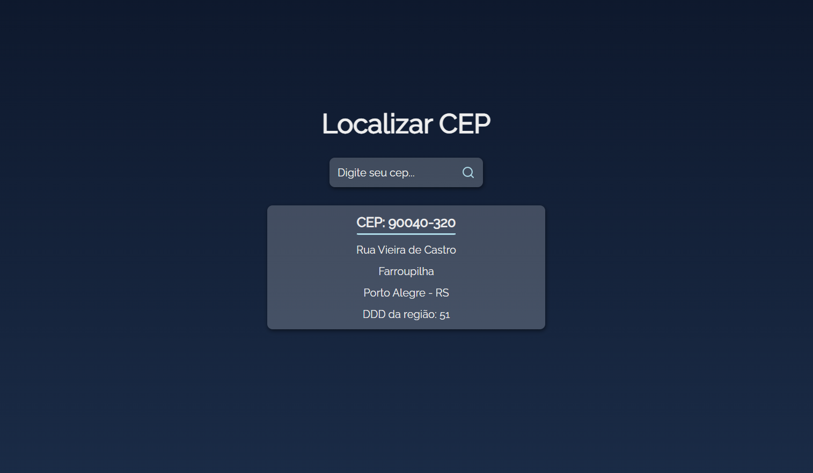

# Localizar CEP

> Projeto para consulta de endereço com CEP criado com React.JS e utilizando o serviço ViaCep.

## 💻 Tecnologias
Este projeto foi desenvolvido com as seguintes tecnologias:

* HTML
* CSS
* JAVASCRIPT
* REACT.JS

## ☕ Como utilizar
Insira o CEP no campo de texto e aperte o botão de pesquisa.
Você pode acessar o projeto [clicando aqui](https://buscar-cep-react.vercel.app).
